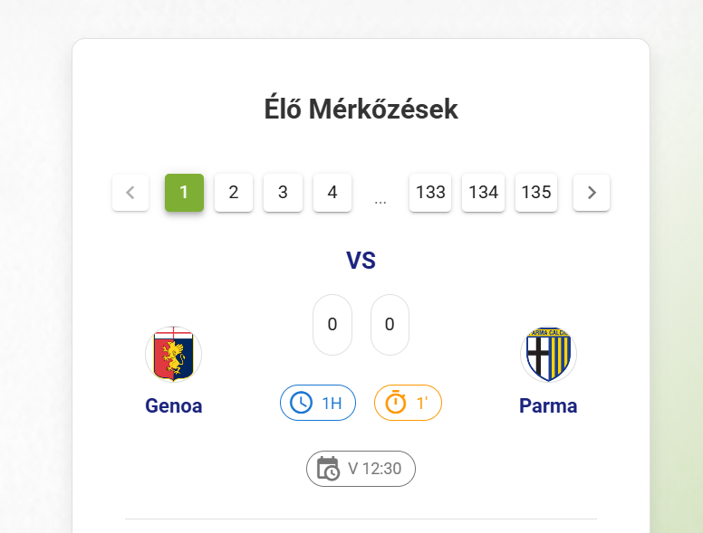
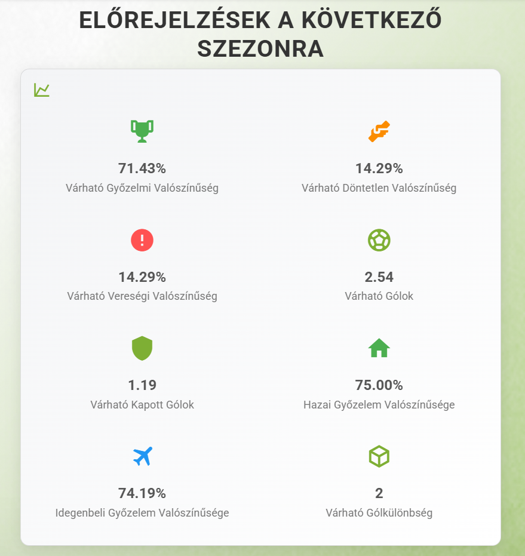
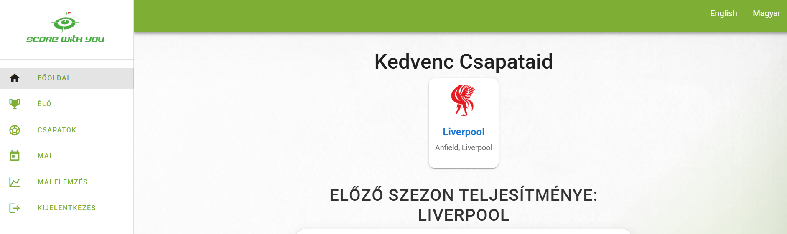
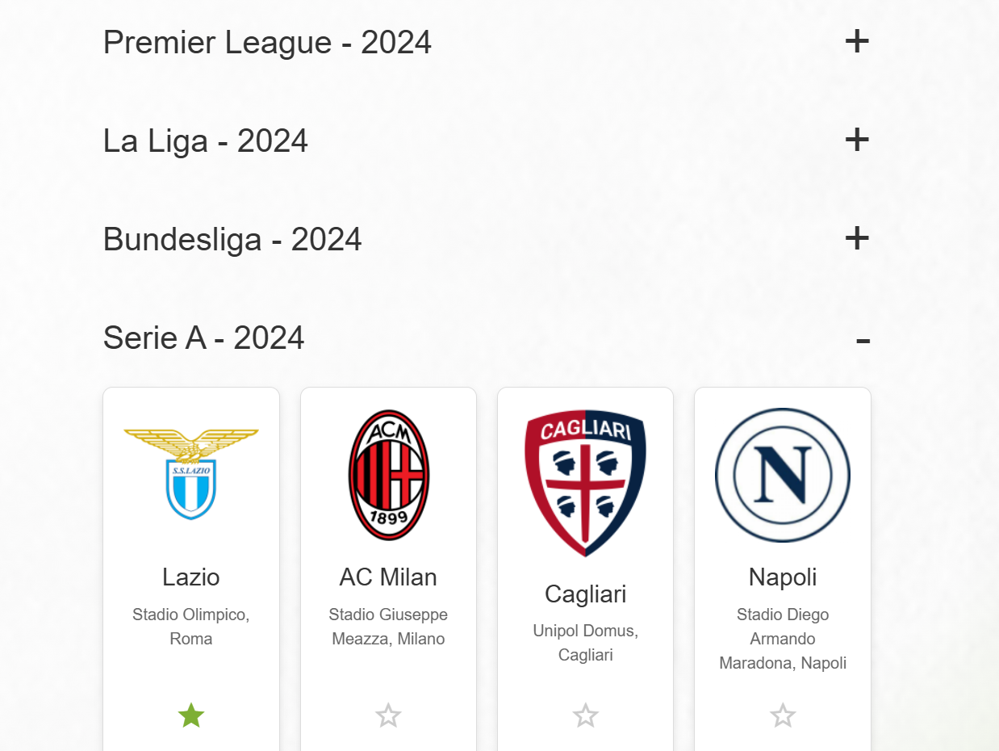
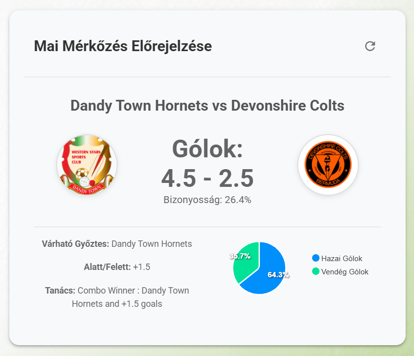

# ScoreWU – Live Sports Tracker & Predictor (Backend)

**ScoreWU** is a full-stack web application for live sports score tracking, match prediction, and user interaction via voting. The project was created as a BSc thesis at the University of Szeged, combining real-time data handling, user authentication, and machine learning-based forecasting.

## 🧠 Purpose

To build a unified platform that allows users to:
- Track live sports matches
- View match statistics and historical data
- Make predictions and analyze outcomes
- Follow favorite teams and leagues

## 🔧 Tech Stack

- **Frontend**: Vue.js, SCSS, i18n (multilingual support)
- **Backend**: Node.js, Express.js
- **Database**: MongoDB
- **Machine Learning**: TensorFlow.js (multilayer neural network)
- **Authentication**: JWT, password hashing
- **Other**: .env-based environment management, RESTful API structure

## ✨ Features

- 🔐 **User Authentication**  
  Register/login with hashed passwords and session tokens

- 📡 **Live Match Tracking**  
  Real-time match data fetched from an external API

- 📊 **Prediction Engine**  
  Neural network using previous season data to forecast match results

- ⚽ **Favorite Teams**  
  Follow clubs across the top 5 leagues and view related stats

- 🗓️ **Match Calendar**  
  Daily schedule of upcoming and past matches

- 🌍 **Multilingual UI**  
  Language toggle between English and Hungarian

- 🎨 **Responsive Design**  
  Built with SCSS + global styling components

## 📷 Screenshots

  
*Live scores and quick stats*

  
*Match analysis and forecast based on neural network*

  
*My team section*

  
*Teams section*

  
*Today's prediction*

## 🧠 About the Prediction Model

The prediction module uses **TensorFlow.js** and is based on:
- Goals scored and conceded from the previous season
- Home vs away stats
- Outcome probabilities: win, draw, loss
- Average expected goals and predicted goal difference

Dropout layers are used to reduce overfitting.

## 🚀 Getting Started

## Installation

To set up the project locally, follow these steps:

### Prerequisites

- Node.js (v16 or later recommended)
- npm (Node Package Manager)

### Setup

1. Clone the repository to your local machine:
   ```bash
   git clone [repository-url]
   cd scorewu-server
   ```

2. Install the necessary dependencies:
   ```bash
   npm install
   ```

3. Start the server:
   ```bash
   node index.js
   ```

## Usage

Once the server is running, it listens on the default port and serves the API endpoints related to sports data and user management. Refer to the API documentation (not provided here) for detailed endpoint usage.
